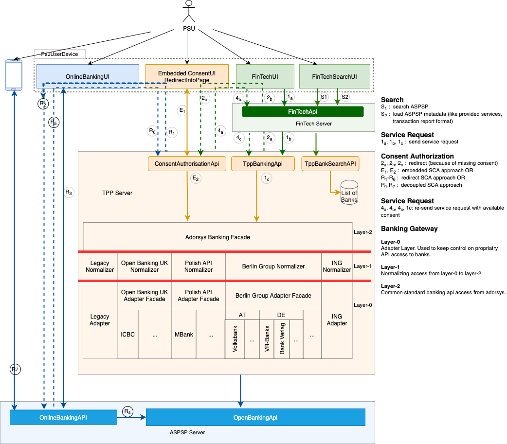

**Code coverage**
 - Backend: 
 - Frontend: 
 - Example code: 

# Open Banking Gateway
Provides tools, adapters and connectors for transparent access to open banking apis. The initial effort focuses on the connectivity to banks that implement the European PSD2 directive either through one of the common market initiatives like : [The Berlin Group NextGenPSD2](https://www.berlin-group.org/psd2-access-to-bank-accounts), [The Open Banking UK](https://www.openbanking.org.uk/), [The Polish PSD2 API](https://polishapi.org/en/) or even through proprietary bank api like  [the ING’s PSD2 API](https://developer.ing.com/openbanking/).

## What this Project is about

### Tackle the Key Challenge for Third Party Providers of Payment Services
The European PSD2 as the first regulator driven Open Banking initiative offers many opportunities for both banks, known as traditional provider of payment services (called ASPSPs in this context) and other Third Party Providers of payment services (TPPs). TPPs can use account information and payment services provided by banks to offer new innovative services to bank account holders. The more banks and TPPs can interact with each other, the more payment account holders can be provided with reacher banking solutions, which in turn simplifies and leverage commercial value chains.

Being able to interact with different banking APIs can be a time and cost consuming challenge. Even though the PSD2 requires European banks to provide APIs and despite the effort of market initiatives to provide common standard interfaces, there is still a multitude of divergent authorization schemes involved and a lot of space for implementation options. A bank can even decide not to join one of the known market initiatives and define it's own PSD2 compliant API. 

The purpose of this open banking gateway is to provide the community with a common and simple interface for accessing major Open Banking APIs.

### Introducing the FinTech as a Major Role
Being a regulator driven initiative, PSD2 mandates the regulation of TPPs. With this additional detail, the market is experiencing a distinction between regulated TPPs and non regulated FinTechs. This framework is therefore designed taking in consideration the existence of the category of payment service providers called FinTech that used APIs exposed by a regulated TPP to access payment services exposed by banks.

### Address Security Issues associated with PSU Access to Multiple Interfaces
In the Open Banking Context, a payment service user (PSU or banking account holder) might have to deal with up to 3 different user interface to initiate, authorize and get the requested banking service executed. There being redirected back and forth from one UserAgent (resp. device) to another. This intensive use of redirection in Open Banking bearing a lot of risk of impersonating the PSU, we set a goal of this Framework to dissect the complexity involved with those redirection processes and open forums for discussion of possible solutions and sample implementations. Following papers are the first attempt to capture the problem ([UserAgent Redirection](docs/architecture/concepts/psu-device-redirection.md), [PSU Access Security Design](docs/architecture/concepts/psu-security-concept.md)).  
 
 
## Project Demo
 
 - [Demo deployment and guide](docs/demo_env.md)

## Big Picture

The following picture displays the overall architecture of this banking gateway:

## Security concept

The following picture displays the overall security concept of this banking gateway:

Security concept has 2 kinds of flows:
  - authenticated (for consent sharing)
  - anonymous (for payments, but can be authenticated too). 

Here are detailed diagrams of each flow:
 - [Authenticated security concept detailed flow](docs/img/security-details/authenticated-security-concept-details.png)
 - [Anonymous security concept detailed flow](docs/img/security-details/anonymous-security-concept-details.png)

## Technical architecture

The following picture displays the overall technical architecture concept of this banking gateway:

**Key components as shown on diagram**:

**APIs:**
 - [Banking API](opba-banking-rest-api) and its implementation [Banking API Impl](opba-banking-rest-impl)
 - [Consent API](opba-consent-rest-api) and its implementation [Consent API Impl](opba-consent-rest-impl)

 **Facade:**
 - [Banking protocol facade](opba-banking-protocol-facade)
 
 **Protocol:**
  - [Banking protocol API](opba-protocols/opba-protocol-api)
  - [XS2A compliant banking protocol Impl](opba-protocols/xs2a-protocol)

## Running the project locally

 - [docker-compose-dev.yml](https://github.com/adorsys/open-banking-gateway/tree/develop/docker-compose-dev.yml) - docker-compose file in the project root for **Development** (requires building docker images)
 - [docker-compose.yml](https://github.com/adorsys/open-banking-gateway/tree/develop/docker-compose.yml) - docker-compose file in the project root for **Demo** (Images will be pulled from DockerHub)

## Postman scripts to play with API 

- [postman-collections](postman/collections)
- [postman-environments](postman/environments)

### Postman collection details

- [postman-ais-collection](https://github.com/adorsys/open-banking-gateway/tree/develop/postman/collections/OPBA-AIS-HBCI-OR-XS2A-EMBEDDED-2-SCA-METHODS.postman_collection.json) Xs2a-embedded or HBCI AIS (account information services) example - getting users' account and transactions list

**Note:** Postman requires disabled request signing functionality - for that use Spring-profile `no-signature-filter`

## Information for developers:
 
 - Working with BPMN: As most protocols use BPMN, we have developed 
 the [plugin 'Flowable BPMN visualizer'](https://plugins.jetbrains.com/plugin/14318-flowable-bpmn-visualizer) that directly integrates into IntelliJ
 with code navigation, refactoring and other stuff for **Flowable BPMN engine**. It will make your work a lot easier
 as you don't need to leave IntelliJ to change diagram or to see what class is used at which step.
 
 - Starting with project: [How to start with project](https://github.com/adorsys/open-banking-gateway/tree/develop/how-to-start-with-project) 
 
  - Populating database with bank data: [How to fill database with bank data](https://github.com/adorsys/open-banking-gateway/tree/develop/opba-db/README.md) 

## Documentation

Please take a look into our [**documentation**](https://adorsys.github.io/open-banking-gateway/doc/develop/) to know more about:

### Planned and released versions

* [Versioning, Release and Support policy](docs/version_policy.md)
* [Release notes](docs/releasenotes.md) 
* [Roadmap for next features development](docs/roadmap.md)

### Architecture 
* [Dictionary](docs/architecture/dictionary.md)
* [Use Cases](docs/architecture/use_cases.md)
* [Banking Protoсol Design](docs/architecture/technical-details.md)
* [User Agent Redirection](docs/architecture/concepts/psu-device-redirection.md)
* [PSU Access Security Design](docs/architecture/concepts/psu-security-concept.md)
* [JavaDoc](https://adorsys.github.io/open-banking-gateway/javadoc/latest/index.html)

## Third Parties Contribution

This project is designed to enable contribution from different sources, as the open banking challenge will start with a magnitude of discrepancies in individual bank implementations, even for banks implementing a common standards.

### How to contribute

* [Getting started](docs/getting_started.md)
* [Contribution Guidelines](docs/ContributionGuidelines.md) 
 
## Authors & Contact

* **[Francis Pouatcha](mailto:fpo@adorsys.de)** - *Initial work* - [adorsys](https://www.adorsys.de)

See also the list of [contributors](https://github.com/adorsys/open-banking-gateway/graphs/contributors) who participated in this project.

For commercial support please contact **[adorsys Team](https://adorsys.de/)**.

## License

This project is licensed under the Apache License version 2.0 - see the [LICENSE](LICENSE) file for details

